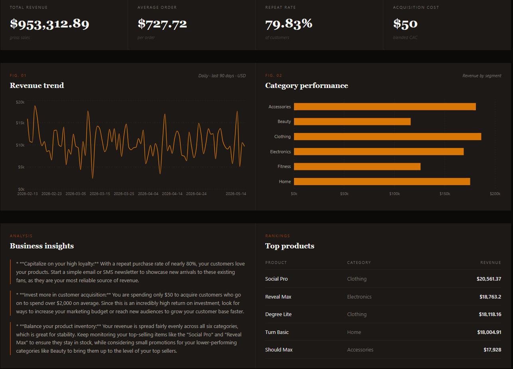
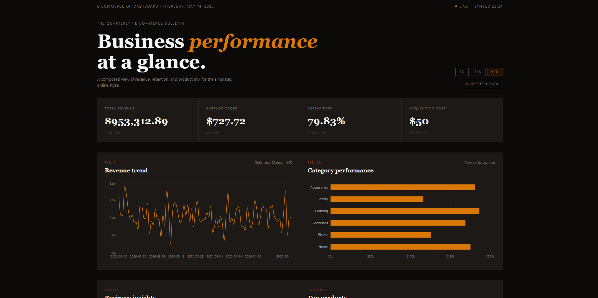

# E-Commerce KPI Dashboard

A full-stack business analytics dashboard that turns simulated e-commerce transaction data into actionable KPIs and plain-English business insights. Built with a FastAPI backend, SQLite database, and React frontend, then deployed with Render and Vercel.

**[Live Demo →](https://ecommerce-kpi-dashboard-tau.vercel.app)**



---

## What it does

The dashboard uses a seeded SQLite database of simulated e-commerce orders, customers, and products, then surfaces the metrics a small business operator would actually monitor:

| Metric | Description |
|---|---|
| **Total Revenue** | Sum of completed orders within the selected period |
| **Average Order Value** | Revenue divided by order count |
| **Repeat Purchase Rate** | Percentage of customers who placed more than one order |
| **CAC Estimate** | Blended customer acquisition cost based on new signups |
| **Customer Lifetime Value** | Average revenue generated per unique customer |
| **Revenue Trend** | Daily revenue plotted over the selected window |
| **Category Performance** | Revenue broken down by product category |
| **Top 5 Products** | Highest-grossing products ranked by revenue |
| **Business Insights** | Rule-based natural language recommendations derived from the KPIs |

All metrics respond to a **7 / 30 / 90-day filter** — switching the window re-fetches the API and recalculates the dashboard for the selected period.

---

## Screenshots



*Metric cards with serif typography and amber-gold accent palette*


*Full page — editorial masthead, horizontal category chart, insights panel, and top products table*

---

## Tech stack

**Frontend**
- [React 19](https://react.dev/) — UI library
- [Vite 8](https://vitejs.dev/) — build tool and dev server
- [Tailwind CSS v4](https://tailwindcss.com/) — utility-first styling
- [Recharts](https://recharts.org/) — composable chart library

**Backend**
- [FastAPI](https://fastapi.tiangolo.com/) — async REST API framework
- [SQLAlchemy](https://www.sqlalchemy.org/) — ORM for database access
- [SQLite](https://www.sqlite.org/) — lightweight embedded database
- [Uvicorn](https://www.uvicorn.org/) — ASGI server

**Deployment**
- Frontend → [Vercel](https://vercel.com/)
- Backend → [Render](https://render.com/)

---

## Architecture

```
┌─────────────────────────────┐       ┌──────────────────────────────┐
│        Vercel (CDN)         │       │        Render (server)       │
│                             │       │                              │
│  React + Vite (static SPA)  │──────▶│  FastAPI + SQLite (REST API) │
│  ecommerce-kpi-dashboard    │  HTTP │  ecommerce-kpi-dashboard-api │
│  -tau.vercel.app            │       │  .onrender.com               │
└─────────────────────────────┘       └──────────────────────────────┘
```

- The frontend is a fully static SPA. It has no server — Vercel just serves the Vite build output.
- The backend is a stateless FastAPI app. On first startup it seeds a fresh SQLite database if none exists.
- All cross-origin requests are handled via FastAPI's CORS middleware, which explicitly allows the Vercel origin.
- The `VITE_API_BASE_URL` environment variable is baked into the frontend bundle at build time by Vite. It must be set in Vercel's project settings — it is not committed to the repository.

---

## Running locally

### Prerequisites

- Python 3.10+
- Node.js 18+

### Backend

```bash
cd backend
python -m venv venv
source venv/bin/activate        # Windows: venv\Scripts\activate
pip install -r requirements.txt
uvicorn main:app --reload
```

The API will be available at `http://localhost:8000`. On first run it seeds the database automatically.

Verify it's working:
```
GET http://localhost:8000/health
GET http://localhost:8000/metrics?days=90
```

### Frontend

```bash
cd frontend
npm install
npm run dev
```

The app will be available at `http://localhost:5173`. By default it points to `http://localhost:8000` — no `.env` file needed for local development.

---

## Project structure

```
eccomere-kpi-dashboard/
│
├── backend/
│   ├── main.py            # FastAPI app, CORS config, route definitions
│   ├── calculations.py    # All KPI calculations against the database
│   ├── insights.py        # Rule-based natural language insight generation
│   ├── seed_data.py       # Synthetic data seeder (runs once on startup)
│   ├── models.py          # SQLAlchemy ORM models
│   ├── database.py        # Database session setup
│   └── requirements.txt
│
├── frontend/
│   └── src/
│       ├── App.jsx        # Entire frontend — components, charts, data fetching
│       ├── main.jsx       # React root
│       └── index.css      # Tailwind import
│
└── screenshots/
    ├── ecomscreenshot1.png
    └── ecomscreenshot2.png
```

---

## Deploying your own copy

### Backend on Render

1. Create a new **Web Service** on Render, connected to this repository
2. Set the root directory to `backend`
3. Build command: `pip install -r requirements.txt`
4. Start command: `uvicorn main:app --host 0.0.0.0 --port $PORT`
5. Once deployed, copy the service URL (e.g. `https://your-api.onrender.com`)

### Frontend on Vercel

1. Import the repository into Vercel
2. Set the root directory to `frontend`
3. Add an environment variable:
   - **Name**: `VITE_API_BASE_URL`
   - **Value**: your Render service URL
4. Add your Vercel deployment URL to the `allow_origins` list in `backend/main.py` and redeploy the backend
5. Deploy — Vercel handles the Vite build automatically

---

## API reference

| Method | Endpoint | Description |
|---|---|---|
| `GET` | `/health` | Health check |
| `GET` | `/metrics?days={7\|30\|90}` | Returns all KPIs and insights for the given period |

**Example response (`/metrics?days=30`)**

```json
{
  "metrics": {
    "selected_period_days": 30,
    "total_revenue": 312847.50,
    "average_order_value": 727.72,
    "repeat_purchase_rate": 79.83,
    "customer_lifetime_value": 2041.00,
    "cac_estimate": {
      "assumed_cost_per_customer": 50,
      "estimated_total_acquisition_cost": 1500,
      "new_customers_in_period": 30
    },
    "category_performance": [...],
    "revenue_trend": [...],
    "top_products": [...]
  },
  "insights": [
    "Capitalize on your high loyalty: With a repeat purchase rate of nearly 80%..."
  ]
}
```

---

## Author

**Hadi Nuno Handrison**
[GitHub](https://github.com/nunohs) · [hadinuno@gmail.com](mailto:hadinuno@gmail.com)
